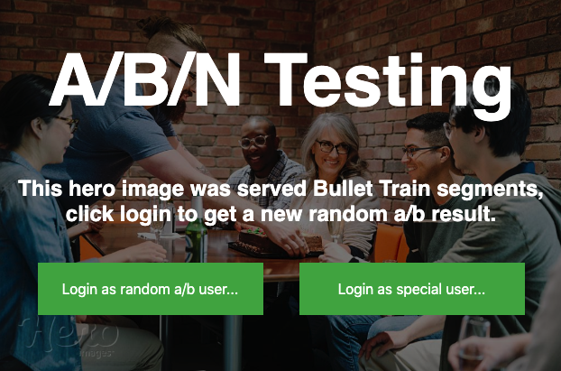
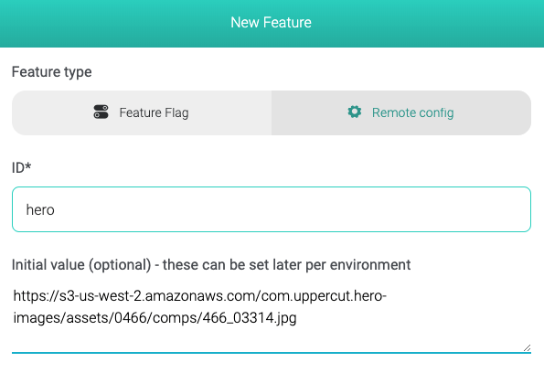
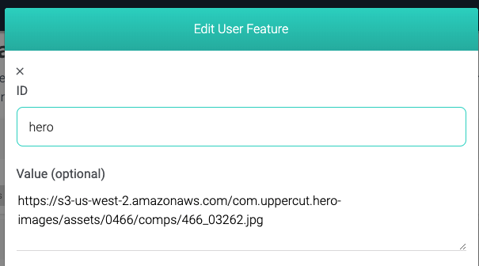

## Bullet Train A/B Testing

This repository contains an example of an a/b test. This is accomplished by creating a feature and overriding the feature's value for a segment with a percentage split rule.
See [https://jsfiddle.net/7e3fdqvx/5/](https://jsfiddle.net/7e3fdqvx/5/)
## Installation 
None! Just open index.html in your preferred browser.

## How was this feature created in Bullet Train?

**Step 1: Create a remote config called hero**

Set the value to be the image path you want

**Step 2: Create a segment with a percentage split**

This will mean you can override features for 50% of your users.

**Step 3: Add another segment or user override**

This overrides the hero image for a particular user, the same can be done for a particular segment of users.
You can always override your % split override for particular users or other segments.

